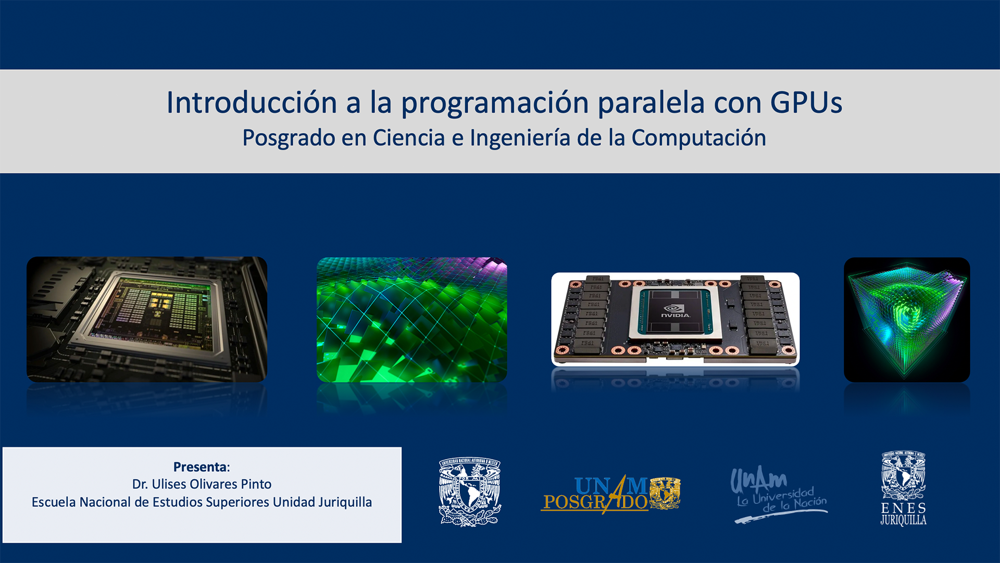

# Posgrado en Ciencia e Ingeniería de la Computación 
## Introducción a la Programación Paralela con GPUs
###  Semestre: 2021-1

## Profesor
 Dr. Ulises Olivares Pinto

## Objetivo del curso
Presentar al estudiante el modelo de programación paralela empleando Unidades de
Procesamiento Gráfico (GPUs). Se utilizarán los GPUs como dispositivo de propósito
general para la resolución de problemas inherentemente paralelos.

## Prerequisitos
#### Deseables
+ Dominio de los lenguajes de programación C y C++ 
+ Conicimiento básico de estructuras de datos y algoritmos

#### Hardware
Se deberá contar con una computadora con GPU de la marca NVIDIA

#### Software
Se deberá contar con el siguiente software instalado 

  + [CUDA Toolkit] (https://developer.nvidia.com/cuda-toolkit)
  + Entonrno de desarrollo integrado(IDE)
    - Eclipse
    - Clion
  + [NVIDIA NSIGHT](https://developer.nvidia.com/nsight-visual-studio-edition)
    

#### Cuentas
Se deberán crear cuentas en las siguientes plataformas:
  + Crear una cuenta en GitHub
  
## Contenido del curso
| No.        | Tema           | Código  |  Material complementario|
| :-------------: |:-------------|:-----:| :-----|
| 1.              |Introducción a la programación con GPUs               |   --     |  Artículos<ol><li>[link](https://arxiv.org/abs/1202.4347)</li><li>[link](https://dl.acm.org/doi/abs/10.1145/1365490.1365500)</li><li>[link](https://www.sciencedirect.com/science/article/abs/pii/S0743731508000932)</li></ol>        | 
| 2.              |Modelo de ejecución paralela                          | [vectorAdd.cu](code/vectorAdd.cu)        |          | 
| 3.              |Jerarquía de memoria  |         |          |   
| 4.              |Transferencia asíncrona de datos (Patrones de acceso: Memoria constante)                 | <ol> <li>[convolution.cu](code/convolution.cu)</li> </ol>       |          |    
| 5.              |Cooperación y sincronización de hilos               |         |          |    
| 6.              |Operaciones atómicas               |         |          |    
| 7.              |Optimización y rendimiento               |         |          |    
| 8.              |Aplicaciones               |         |          |    

##### Última actualización: 01 de octubre de 2020
